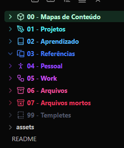
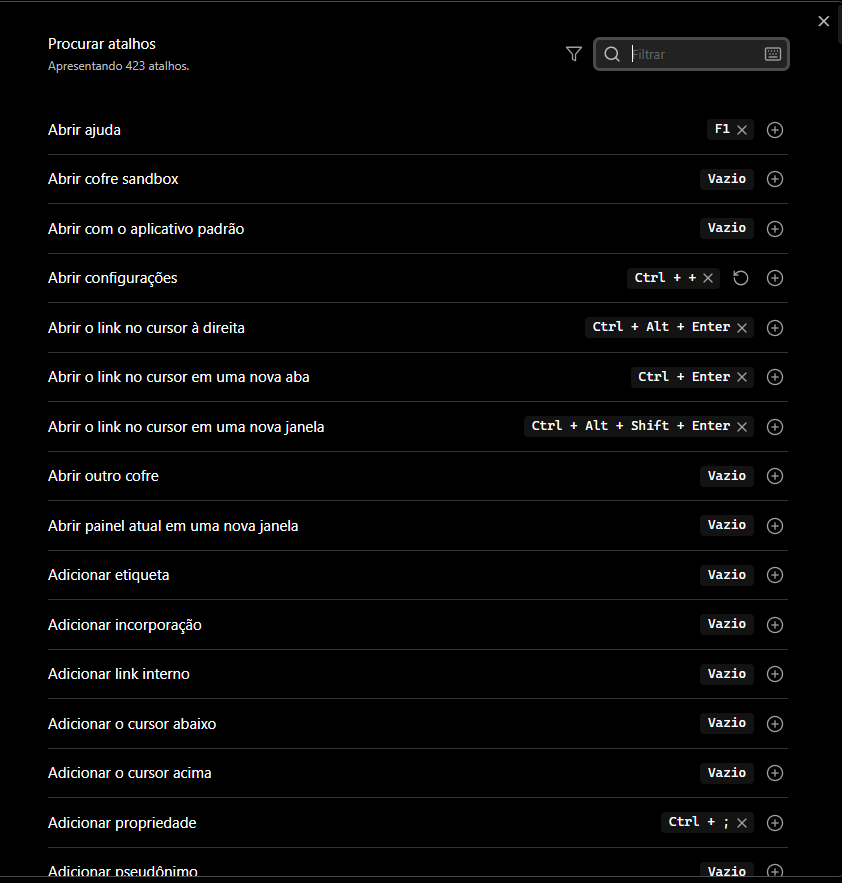
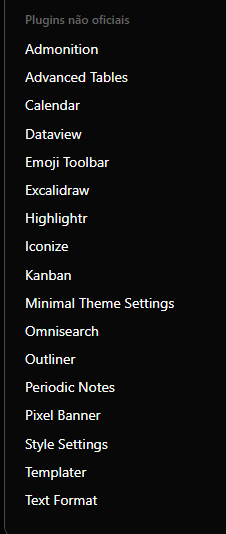
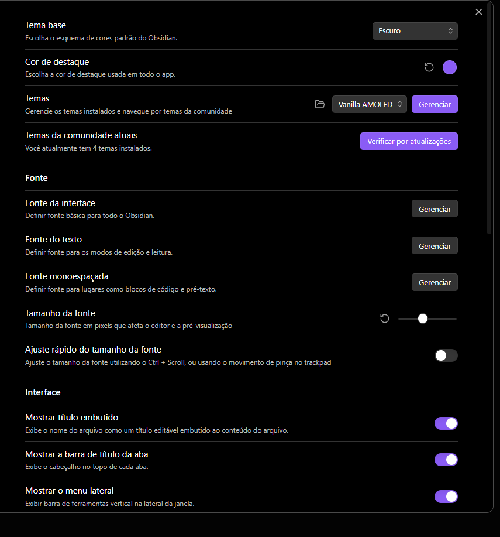

# Obsidian – Config 


Repositório **profissional** para versionar e replicar o **setup do Obsidian** do cofre _Organização_.  
Aqui você encontrará **temas, plugins, snippets, hotkeys e preferências** — **sem** notas pessoais. Ideal para manter a mesma experiência em várias máquinas ou compartilhar um template limpo.

---

## 🔧 Downloads necessários

> Siga esta sessão para preparar qualquer máquina antes de aplicar o setup.

1. **Obsidian**
   - Site oficial: <https://obsidian.md/download>
   - Após instalar, abra o app e **desative o _Safe Mode_** para permitir plugins da comunidade:  
     `Settings → Community plugins → Turn on`.

2. **Git (para sincronizar via GitHub)**
   - Git for Windows: <https://git-scm.com/downloads>
   - (Opcional) **Git LFS** se você versionar imagens/vídeos em outros repositórios: `git lfs install`.

3. **Fonts recomendadas (opcionais)**
   - **JetBrains Mono**: <https://www.jetbrains.com/lp/mono/>  
   - **Fira Code**: <https://github.com/tonsky/FiraCode>  
   - **Nerd Fonts** (para ícones nos temas): <https://www.nerdfonts.com/>  
   > **Windows**: clique-duplo no `.ttf` → **Instalar**. Depois selecione a fonte nas preferências do tema do Obsidian.

4. **Plugins da Comunidade usados / sugeridos**
   - Abra `Settings → Community plugins → Browse` e instale (ou ative) os que desejar:
     - **Templater** – automação de templates
     - **Periodic Notes** – notas diárias/semanais/mensais
     - **Calendar** – calendário lateral integrado
     - **Dataview** – consultas dinâmicas
     - **QuickAdd** – capturas rápidas e macros
     - **Advanced Tables** – tabelas melhores em Markdown
     - **Admonition** – blocos de chamada/alertas
     - **Obsidian Git** – commits/pulls/push automáticos
     - **Iconize ou Supercharged Links** (opcional para ícones)
   - As **preferências** (atalhos, tema e layout) já vêm neste repo via `.obsidian/`.

---

## 🗂️ Estrutura do **Template** (pasta do cofre)

A pasta do cofre **não** está neste repo, mas o template recomendado é:

```
Organização/
├─ 00 - Mapas de Conteúdo/
├─ 01 - Projetos/
├─ 02 - Aprendizado/
├─ 03 - Referências/
├─ 04 - Pessoal/
├─ 05 - Work/
├─ 06 - Arquivos/
├─ 07 - Arquivos mortos/
└─ 99 - Templates/
```

- **Estrutura de pastas**  
  `assets/screens/estrutura-pastas.png`  
  

- **Tema e aparência**  
  `assets/screens/aparencia-tema.png`  
  

- **Plugins instalados**  
  `assets/screens/plugins-instalados.png`  
  

- **Atalhos (Hotkeys)**  
  `assets/screens/atalhos.png`  
  

---

## 🚀 Como **aplicar** esta configuração em um cofre existente

> Use quando você já tem suas notas e quer aplicar **somente** a configuração visual e de plugins.

1. **Feche o Obsidian**.
2. Faça um **backup** da pasta `.obsidian/` atual do seu cofre (se existir).
3. **Clone** este repositório em qualquer pasta temporária:
   ```bash
   git clone https://github.com/SEU_USUARIO/obsidian-organizacao-config.git
   ```
4. **Copie** a pasta `.obsidian/` do repositório clonado para a **raiz do seu cofre** (a pasta que contém suas notas).
5. Abra o Obsidian. Os plugins/temas/hotkeys serão carregados.
6. Vá em `Settings → Community plugins` e **habilite** os plugins desejados (se necessário).

> 💡 **OneDrive/Dropbox**: se seu cofre estiver em uma pasta sincronizada na nuvem, evite conflitos pausando a sync enquanto copia/commita.

---

## 🛠️ Como **atualizar e publicar** mudanças (GitHub)

Sempre que mudar tema, atalhos ou instalar/remover plugins:

```bash
# na raiz do cofre (onde está a pasta .obsidian/)
git add .obsidian
git commit -m "chore: update obsidian config"
git push
```

> Se seu `.gitignore` ignora tudo (`*`), garanta que ele **permite** `.obsidian/` e opcionalmente `README.md`:
>
> ```gitignore
> *
> !.gitignore
> !/README.md
> !.obsidian/
> !.obsidian/**
> .obsidian/cache/
> .obsidian/workspace*.json
> ```

---

## 🔒 Segurança & Privacidade

- Este repo não contém notas pessoais, apenas `.obsidian/`.
- Antes de publicar, **busque segredos** em plugins:
  ```bash
  # Windows PowerShell
  Get-ChildItem -Recurse .obsidian\plugins | Select-String -Pattern 'token|api_key|secret'
  ```
- Mantenha o repo **privado** se houver risco de vazar configs sensíveis (ex.: endpoints internos).

---

## ❓ FAQ

**Posso usar este repo como “tema” em várias máquinas?**  
Sim. Basta copiar `.obsidian/` para a raiz de cada cofre onde quer replicar o setup.

**E se o layout (painéis/abas) ficar estranho?**  
Apague `workspace.json` (já está ignorado por padrão) e reabra o Obsidian. Reposicione os painéis e salve.

**Preciso instalar todos os plugins da lista?**  
Não. A lista é uma base recomendada. Ative só os que fazem sentido para você.

**Dá para versionar _também_ as notas?**  
Sim, mas faça em **outro repositório** (ou ajuste o `.gitignore`). Cuidado com privacidade.

---

## 👤 Autor

**Miguel de Castilho Gengo**  
Estudante de Engenharia de Computação (PUC-Campinas) • Dev C/Java/Python • Robótica & Cibersegurança

**Links**
- GitHub: [@Gengo250](https://github.com/Gengo250)
- LinkedIn: [miguel-gengo-8157b72a1](https://www.linkedin.com/in/miguel-gengo-8157b72a1)
- E-mail: [miguelgengo28@gmail.com](mailto:miguelgengo28@gmail.com)

Se este setup te ajudou, deixa uma ⭐ no repositório e sinta-se à vontade para abrir uma *Issue* com sugestões.
